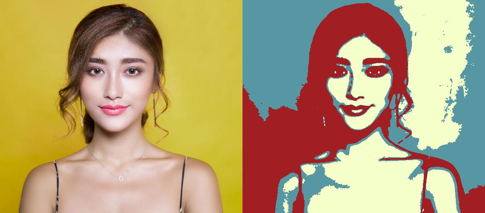
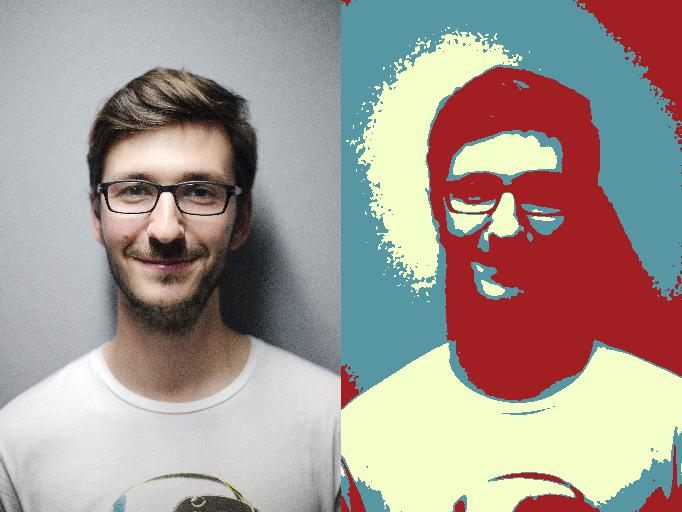
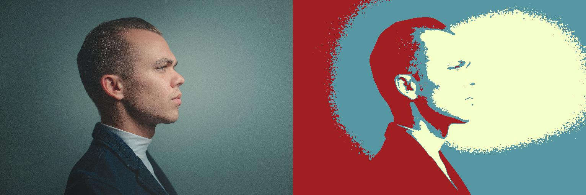
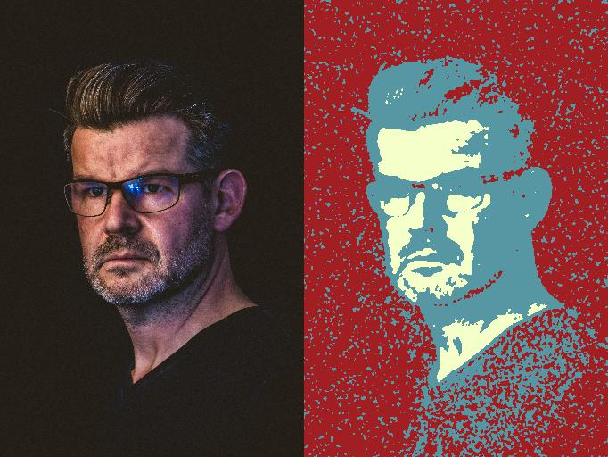
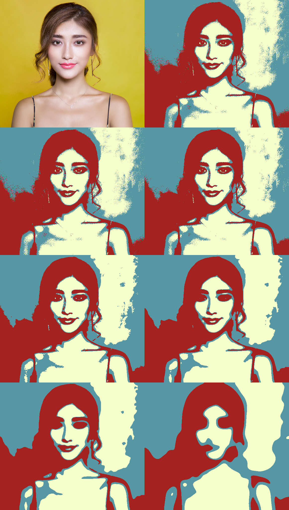

# Posterize Images

## Introduction

This program will help you give a poster feel to your portrait. It is not a complete version and is still in development. This version works fairly well on **some** images. The idea for this kind of poster came from [Barack Obama's Hope poster](https://en.wikipedia.org/wiki/Barack_Obama_%22Hope%22_poster). However, the posters generated will have only 3 colors, instead of 5.

The approach was inspired by [Maximally Stable Extremal Regions (MSER)](https://en.wikipedia.org/wiki/Maximally_stable_extremal_regions). The idea is to find the most stable blob which contains pixels with intensities less than a particular value. Stability here refers to stable shapes.

## Algorithm

The algorithm is very simple. We have two intensity thresholds (can be more than that). These thresholds sort each pixels into one of the three bins based on its intensity. The objective function to be maximized is the product of the areas of these regions (or geometric mean).

## How to run

Clone this repo using `git clone https://github.com/gautamsreekumar/posterize.git`. Run `python main.py` with necessay options including the location of the input image. To see available options, run `python main.py -h`.

## Results

Like mentioned before, this does not work perfectly well for all portrait images. Preferrably, the background better be a uniform colour which is neither too bright nor too dark compared to other colours in the image. Below are some results on some stock images taken from [Pexels](https://www.pexels.com/search/face/). All images were rescaled to have height of 512px while maintaining the aspect ratio. Some bad examples are purposefully included to give you a rough idea of where this will not work. You can try different values for maximum number of iterations and sigma values and see what works best.

You can try for various values of sigma for Gaussian smoothing in the preprocessing stage. Below image shows the output for the following values in clockwise order, starting from top-left - input, no smoothing, 0.5, 2, 10, 3, 1, 0.1 .

One of my friends pointed out that this method was similar to [Otsu's method](https://en.wikipedia.org/wiki/Otsu's_method).

## Required packages

These are the versions of the packages used while development.

* numPy        1.15.4
* scipy        1.1.0
* scikit-image 0.14.1
* matplotlib   2.2.3
* imageio      2.4.1